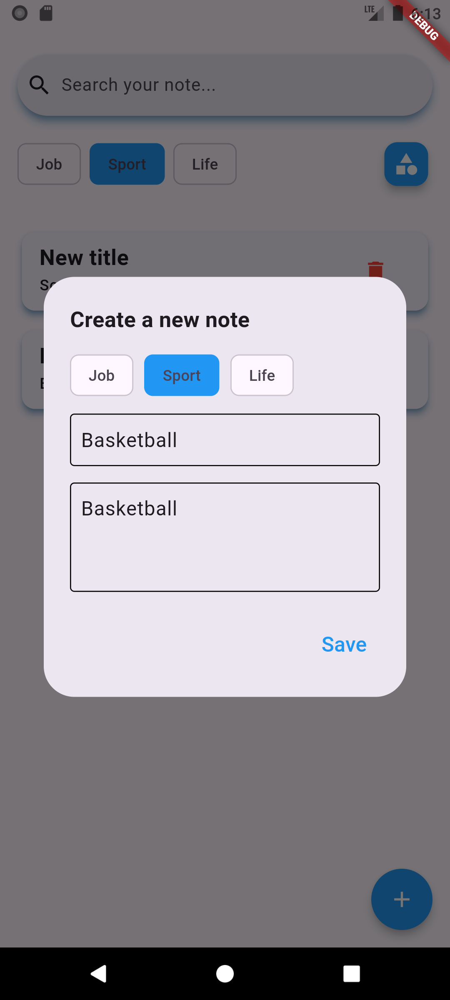

# Flutter Note App

A simple and convenient mobile application on Flutter for creating, editing and deleting categories and notes associated with them. It is also possible to search for notes within the selected category.

## Technologies

### Core Technologies

- [![Dart][dart-shield]][dart-url]
- [![Flutter][flutter-shield]][flutter-url]

### Database

- [![Floor][floor-shield]][floor-url]

### Navigation

- [![Go_Router][go_router-shield]][go_router-url]

### State Management

- [![Provider][provider-shield]][provider-url]

### Dependency Injection

- [![Get_It][get_it-shield]][get_it-url]

### Architecture

- [![MVVM Architecture][mvvmarchitecture-shield]][mvvmarchitecture-url]

## How to set up a project
### Steps:
1. Make sure you have Flutter installed.
2. Clone this repository:

   ```
   git clone https://github.com/yozhykovanatolii/NoteApplication.git
   ```
4. Navigate to the project directory:

   ```
   cd NoteApplication
   ```
5. Install dependencies:

   ```
   flutter pub get
   ```
6. Run the app:

   ```
   flutter run
   ```

## Screenshots
<p>
  
  
  
</p>
<p>
  
  
  
</p>
<p>
  
</p>


[dart-shield]: https://img.shields.io/static/v1?message=v3.6.0&color=orange&label=Dart
[dart-url]: https://dart.dev/

[flutter-shield]: https://img.shields.io/static/v1?message=v3.27.1&color=yellow&label=Flutter
[flutter-url]: https://docs.flutter.dev/

[floor-shield]: https://img.shields.io/static/v1?message=v1.5.0&color=blue&label=Floor
[floor-url]: https://pub.dev/packages/floor

[go_router-shield]: https://img.shields.io/static/v1?message=v14.6.3&color=purple&label=Go_Router
[go_router-url]: https://pub.dev/packages/go_router

[provider-shield]: https://img.shields.io/static/v1?message=v6.1.2&color=green&label=Provider
[provider-url]: https://pub.dev/packages/provider

[get_it-shield]: https://img.shields.io/static/v1?message=v8.0.3&color=white&label=Get_It
[get_it-url]: https://pub.dev/packages/get_it

[mvvmarchitecture-shield]: https://img.shields.io/static/v1?message=Structured%20Design&color=red&label=MVVM%20Architecture
[mvvmarchitecture-url]: https://www.digitalocean.com/community/tutorials/android-mvvm-design-pattern
